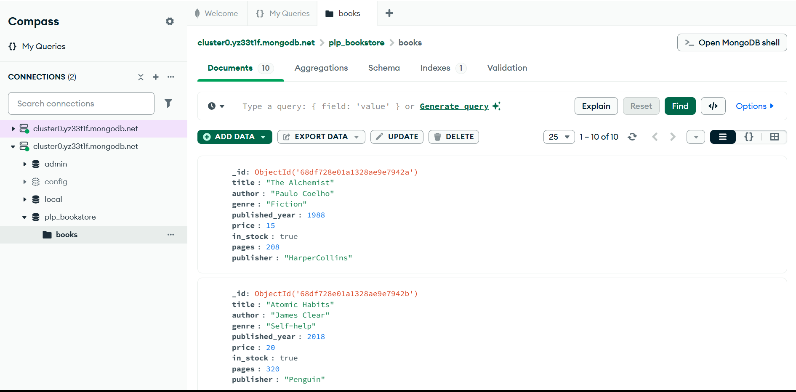

## MongoDB Bookstore Project

This project demonstrates how to connect to a MongoDB Atlas cluster, create a database, and insert documents into a collection using Node.js.

## Project Overview
I built a Bookstore Database in MongoDB with the following features:
- Database: plp_bookstore
- Collection: books
- Documents: At least 10 books, each containing: title (string), author (string), genre (string), published_year (number), price (number), in_stock (boolean), pages (number), publisher (string).

The main goals were:
- Set up a MongoDB Atlas cluster and connect from Node.js.
- Insert sample documents into the database.
- Verify the data in MongoDB Compass.

## Prerequisites
- Node.js(v16+)
- MongoDB Compass OR Atlas Web UI
- MongoDB Atlas cluster with a valid user and whitelisted IP

## Screenshot Proof
Here is a screenshot showing the documents inside the books collection:

## Result
The script successfully connected to MongoDB, created the database plp_bookstore, and inserted 10 book records into the books collection.